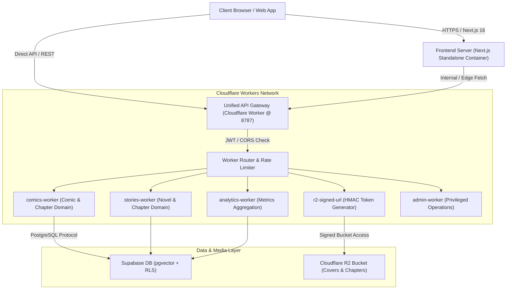

# Light Story — Production Engine & Platform Documentation

[](https://github.com/Heizdoobert/Light-Story/actions/workflows/ci.yml)
[](https://nodejs.org/)
[](https://nextjs.org/)
[](https://workers.cloudflare.com/)
[](https://supabase.com/)
[](https://www.docker.com/)
[](LICENSE)

**Light Story** is an enterprise-grade, high-performance digital publishing platform for web comics and web novels. Designed for sub-second page loads, global edge delivery, and secure digital asset protection, Light Story combines a modern Next.js 16 App Router frontend with a microservices suite of Cloudflare Workers and a Supabase (PostgreSQL + `pgvector`) data layer.

---

## 📋 Table of Contents

- [Architectural Topology](#-architectural-topology)
- [Core Platform Capabilities](#-core-platform-capabilities)
- [Repository Structure](#-repository-structure)
- [Technology Stack](#-technology-stack)
- [Quick Links & Documentation](#-quick-links--documentation)
- [Environment Configuration](#-environment-configuration)
- [Local Development Setup](#-local-development-setup)
- [Production & Docker Deployment](#-production--docker-deployment)
- [Security & Access Control](#-security--access-control)
- [Testing & Quality Assurance](#-testing--quality-assurance)

---

## 🏗 Architectural Topology

Light Story employs a decoupled, edge-first architecture. All API traffic passes through a **Unified API Gateway** running on Cloudflare's global edge network before routing to specialized domain microservices or Supabase.



---

## ✨ Core Platform Capabilities

- 🎨 **Next-Gen Reader Interface**: Optimized image pagination, CBZ comic package extraction, pre-fetching, and responsive layout scaling.
- 🔍 **AI Semantic Search**: Vector-based content discovery utilizing Supabase `pgvector` with 1536-dimensional embeddings.
- 🔐 **Secure Media Distribution**: Cloudflare R2 bucket protection with short-lived HMAC & JWT signed URLs to prevent hotlinking and pirating.
- 🛡 **Role-Based Access Control (RBAC)**: Multi-tiered access policies (`superadmin`, `admin`, `employee`, `user`) enforced via database Row-Level Security (RLS).
- ⚡ **Edge API Gateway**: Central entry point managing JWT validation, CORS, rate limiting, and request normalization.
- 📊 **Real-time Analytics**: Aggregated view counts, reading history, and user engagement dashboards.

---

## 📁 Repository Structure

```text
Light-Story/
├── frontend/                     # Next.js 16 App Router application (Presentation Layer)
│   ├── src/app/                  # Pages, layouts, and API proxies
│   ├── src/components/           # Reusable UI components (Tailwind CSS v4, Lucide)
│   └── ARCHITECTURE.md           # Frontend architecture documentation
├── packages/
│   └── api-types/                # OpenAPI 3.0 spec & auto-generated TypeScript contracts
├── workers/                      # Cloudflare Workers Microservices
│   ├── unified-gateway/          # Central API Gateway (JWT auth, CORS, routing)
│   ├── r2-signed-url/            # R2 Signed URL generation & asset gating
│   ├── comics-worker/            # Comic & chapter CRUD service
│   ├── stories-worker/           # Novel & story CRUD service
│   ├── analytics-worker/         # Event tracking & metrics collection
│   └── admin-worker/             # Admin management & audit logs
├── backend-supabase/             # Database layer & Supabase migrations
│   ├── supabase/migrations/      # SQL schema, RLS policies, triggers, and functions
│   └── docs/                     # Database schema, RLS, and storage documentation
├── Dockerfile                    # Production multi-stage Docker build file
├── Dockerfile.backend            # Production backend Docker service definition
├── Dockerfile.frontend           # Dedicated frontend production Docker container
├── docker-compose.yml            # Local & staging container orchestrator
└── Instruction_create_key.md     # Production environment variable reference
```

---

## 🛠 Technology Stack

| Component | Technology | Description |
|---|---|---|
| **Frontend** | Next.js 16 (App Router), React 19, TypeScript | High-performance SSR & ISR web interface |
| **Styling** | Tailwind CSS v4, Lucide React, Shadcn UI | Modern responsive glassmorphic design system |
| **API Gateway** | Cloudflare Workers, Hono / Wrangler | Global edge API routing & JWT token verification |
| **Microservices** | Cloudflare Workers (TypeScript) | Decoupled domain microservices |
| **Primary Database** | Supabase (PostgreSQL 15+) | Transactional data store with RLS and triggers |
| **Vector Search** | Supabase `pgvector` | 1536-dim vector embeddings for similarity search |
| **Media Storage** | Cloudflare R2 | S3-compatible asset storage for covers & chapters |
| **Containerization** | Docker, Docker Compose | Multi-stage container builds using `node:22-slim` |

---

## 📚 Quick Links & Documentation

| Document | Description |
|---|---|
| [Unified Gateway Guide](workers/unified-gateway/README.md) | Architecture, routing rules, and authentication for API Gateway |
| [Frontend Architecture](frontend/ARCHITECTURE.md) | Next.js directory structure, client state, and rendering strategies |
| [Database Schema Docs](backend-supabase/docs/db-schema.md) | PostgreSQL tables, foreign keys, enums, and indexes |
| [Row-Level Security (RLS)](backend-supabase/docs/rls-policies.md) | Access control matrices and row security definitions |
| [Storage Configuration](backend-supabase/docs/storage.md) | R2 bucket setup and media folder conventions |
| [Environment Variable Guide](Instruction_create_key.md) | Exhaustive list of required production and staging `.env` keys |
| [Docker Deployment Guide](README.Docker.md) | Container orchestration and cloud container runtime guide |

---

## 🔑 Environment Configuration

Light Story uses environment variable validation across services. Create `.env` in the root directory (or `frontend/.env.local` for Next.js).

### Essential Production Variables

```ini
# Supabase Configuration
NEXT_PUBLIC_SUPABASE_URL=https://your-project.supabase.co
NEXT_PUBLIC_SUPABASE_PUBLISHABLE_KEY=sb_publishable_token_here
SUPABASE_SERVICE_ROLE_KEY=sb_service_role_token_here

# Gateway & Worker Endpoints
NEXT_PUBLIC_GATEWAY_URL=https://api.yourdomain.com
JWT_SECRET=your-production-jwt-secret-key

# Cloudflare R2 Storage
R2_ACCOUNT_ID=your_cloudflare_account_id
R2_ACCESS_KEY_ID=your_r2_access_key
R2_SECRET_ACCESS_KEY=your_r2_secret_key
NEXT_PUBLIC_R2_BUCKET_COVERS=light-story-covers
NEXT_PUBLIC_R2_BUCKET_CHAPTERS=light-story-chapters
```

For complete instructions on generating keys and setup rules, see [Instruction_create_key.md](Instruction_create_key.md).

---

## 🚀 Local Development Setup

### Prerequisites

- **Node.js**: `v22.0.0` or higher
- **npm**: `v10.0.0` or higher
- **Supabase CLI**: (optional, for local DB development)
- **Docker Desktop**: (optional, for containerized local testing)

### Step-by-Step Installation

1. **Clone & Install Dependencies:**
   ```bash
   git clone https://github.com/Heizdoobert/Light-Story.git
   cd Light-Story
   npm install
   ```

2. **Generate API Type Definitions:**
   ```bash
   npm run generate:types
   ```

3. **Start Development Services:**
   - **Full Stack (Frontend + API Gateway):**
     ```bash
     npm run dev:all
     ```
   - **Frontend Only (`http://localhost:3001`):**
     ```bash
     npm run dev
     ```
   - **API Gateway Only (`http://localhost:8787`):**
     ```bash
     npm run dev:gateway
     ```

4. **Start Supabase Local Stack (Optional):**
   ```bash
   cd backend-supabase
   supabase start
   ```

---

## 🐳 Production & Docker Deployment

### Building & Running Production Containers

Light Story includes production-optimized multi-stage Dockerfiles.

1. **Build Production Docker Images:**
   ```bash
   npm run docker:build
   ```

2. **Launch Services in Production Mode:**
   ```bash
   npm run docker:up
   ```

3. **Rebuild & Restart Production Stack:**
   ```bash
   npm run docker:rebuild
   ```

### Manual Docker Build Command

```powershell
docker system prune -a --volumes -f; docker build --no-cache --pull -t light-story .
```

---

## 🔒 Security & Access Control

- **JWT Validation**: All non-public routes passing through the Unified Gateway require a valid JWT bearer token.
- **Row-Level Security (RLS)**: Direct Supabase database queries enforce fine-grained user and admin permissions at the database level.
- **Cross-Origin Resource Sharing (CORS)**: Strict origin validation enforced by the API Gateway.
- **Signed Storage URLs**: Chapter media files stored in Cloudflare R2 are exposed using time-limited HMAC signed URLs to prevent unauthorized distribution.

---

## 🧪 Testing & Quality Assurance

Run the automated test suite and type checks:

```bash
# Type checking & TypeScript validation
npm run lint

# Execute frontend integration tests
npm run test:run

# Validate Docker build pipeline
npm run docker:build
```

---

## 📄 License

Distributed under the **MIT License**. See `LICENSE` for details.
